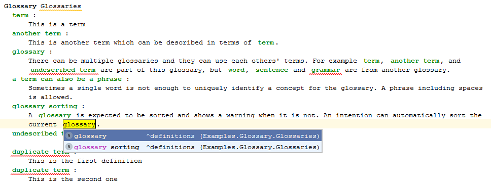
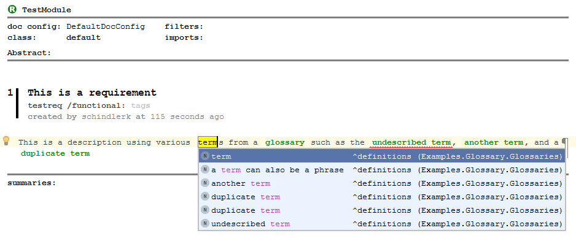

# mps-richtext-glossaries
Glossaries based on slisson/mps-richtext for use with mbeddr's requirements and documentation language.

When writing requirements or other documents, "tangible" definitions which are properly referenced are important.
Changes to these terms should be propagated to all usages.

This is a basic version of glossaries which allows (glossary) terms to be defined in terms of other (glossary) terms.
The result is sometimes not fully natural language, especially when much used terms have been changed afterwards, but this approach does provide quite some consistency in wording.

Some basic checks such as duplicate term definition or using undefined terms has been added to spot "holes" in the definitions.

An example glossary in action can be seen here:

Note that since this uses the more generic *mps-richtext* plugin, this can also be used in conjunction with mbeddr's requirements and documentation languages. For example:

The current version works on MPS 2019.3 with a corresponding mbeddr.
